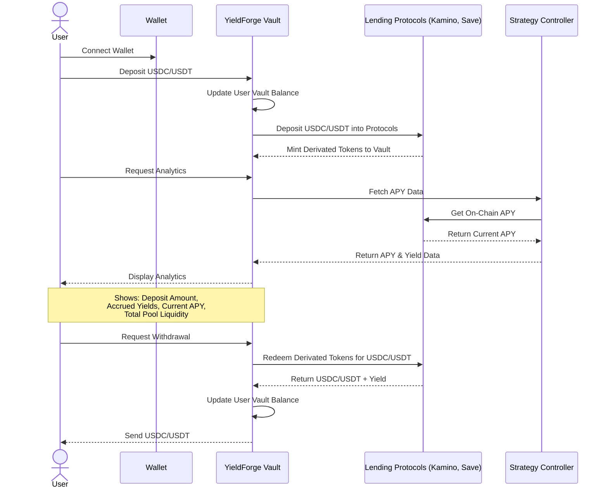
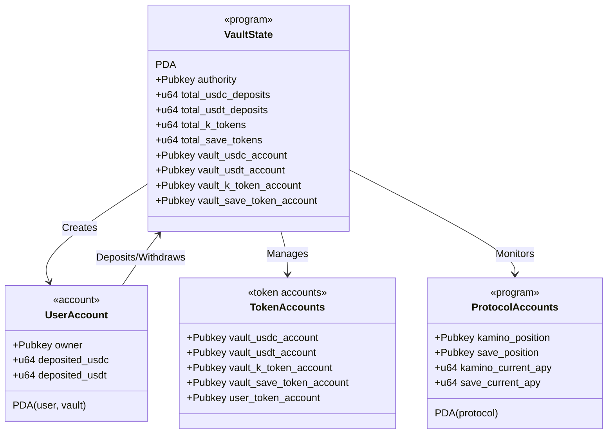

## Architecture Design

### User Flow Diagram

```mermaid
sequenceDiagram
    actor User
    participant Wallet
    participant YF as YieldForge Vault
    participant LP as Lending Protocols (Kamino, Save)
    participant Strategy as Strategy Controller
    
    %% Deposit Flow
    User->>Wallet: Connect Wallet
    User->>YF: Deposit USDC/USDT
    YF->>YF: Update User Vault Balance
    YF->>LP: Deposit USDC/USDT into Protocols
    LP-->>YF: Mint Derivated Tokens to Vault
    
    %% Analytics Request Flow
    User->>YF: Request Analytics
    YF->>Strategy: Fetch APY Data
    Strategy->>LP: Get On-Chain APY
    LP-->>Strategy: Return Current APY
    Strategy-->>YF: Return APY & Yield Data
    YF-->>User: Display Analytics
    Note over YF,User: Shows: Deposit Amount,<br/>Accrued Yields, Current APY,<br/>Total Pool Liquidity
    
    %% Withdrawal Flow
    User->>YF: Request Withdrawal
    YF->>LP: Redeem Derivated Tokens for USDC/USDT
    LP-->>YF: Return USDC/USDT + Yield
    YF->>YF: Update User Vault Balance
    YF-->>User: Send USDC/USDT
```

### Account Structure

```mermaid
classDiagram
    class VaultState {
        PDA
        <<program>>
        +Pubkey authority
        +u64 total_usdc_deposits
        +u64 total_usdt_deposits
        +u64 total_k_tokens
        +u64 total_save_tokens
        +Pubkey vault_usdc_account
        +Pubkey vault_usdt_account
        +Pubkey vault_k_token_account
        +Pubkey vault_save_token_account
    }

    class UserAccount {
        PDA(user, vault)
        <<account>>
        +Pubkey owner
        +u64 deposited_usdc
        +u64 deposited_usdt
    }

    class TokenAccounts {
        <<token accounts>>
        +Pubkey vault_usdc_account
        +Pubkey vault_usdt_account
        +Pubkey vault_k_token_account
        +Pubkey vault_save_token_account
        +Pubkey user_token_account
    }

    class ProtocolAccounts {
        PDA(protocol)
        <<program>>
        +Pubkey kamino_position
        +Pubkey save_position
        +u64 kamino_current_apy
        +u64 save_current_apy
    }

    VaultState --> UserAccount: Creates
    VaultState --> TokenAccounts: Manages
    VaultState --> ProtocolAccounts: Monitors
    UserAccount --> VaultState: Deposits/Withdraws
```
